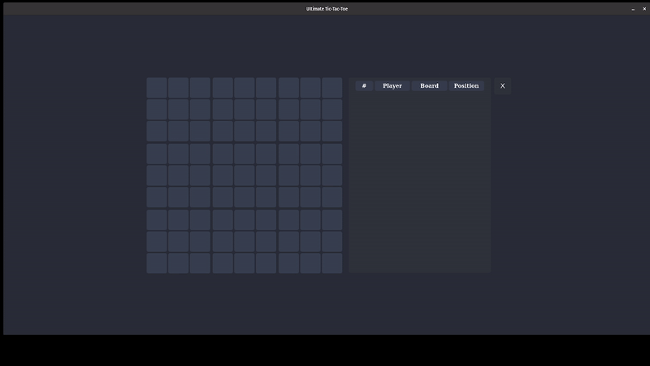

## UltimateTicTacToe

Play [Ultimate Tic-Tac-Toe](https://en.wikipedia.org/wiki/Ultimate_tic-tac-toe) against an AI agent. The project 
utilizes [Monte Carlo Tree Search (MCTS)](https://en.wikipedia.org/wiki/Monte_Carlo_tree_search).

## Demo
  

## Features
✅ AI-powered Gameplay: Uses MCTS to make intelligent moves.  
✅ Java & Python Integration: Communicates between Java and Python via Py4J.  
✅ Fast Search & Decision Making: AI runs simulations to improve move selection.  
✅ Customizable AI Levels: Adjustable difficulty by modifying tree search depth.  
✅ Unit Tested: Covered with JUnit 5 tests.

## MCTS Process:
1️⃣ **Selection:** Traverse the tree using Upper Confidence Bound (UCT).  
2️⃣ **Expansion:** Add a new node if a promising move is found.  
3️⃣ **Simulation:** Play random moves from the new node to estimate the outcome.  
4️⃣ **Backpropagation:** Update node values based on the result.

Formula for **UCT** (used in MCTS decision-making):
```math
UCT = (winScore / visits) + C * sqrt(log(totalVisits) / visits)
```

## Installation & Dependencies
This project is built with Java, Maven, Python and JavaScript. To use it, clone the repository and build with Maven:
### Requirements:
- Java 11+
- Maven
- Python 3.x  
  
#### For Linux:
```bash
sudo apt-get install build-essential libgl1-mesa-dev
pip3 install pyqt5 pyqtwebengine
pip3 install pywebview
pip3 install pywebview[qt]
```

### Clone and Build:
```bash
git clone https://github.com/T-Lak/UltimateTicTacToe.git

cd mcts_gui/

python -m venv .venv
source .venv/bin/activate  # Linux/macOS
.venv\Scripts\activate     # Windows

pip install -r requirements.txt
```

### Usage
```bash
# Start the Java MCTS AI server
mvn compile exec:java -Dexec.mainClass="Main"

# Run the Python UI (if applicable)
cd mcts_gui/
python api.py
```

#### Project Structure
```bash
/src
 ├── main/java/
 │     ├── api/         # Handles external communication (Py4J, etc.)
 │     ├── board/       # Game board logic (GlobalBoard, MCTSBoard)
 │     ├── common/      # Utility classes (Move, Player)
 │     ├── mcts/        # Monte Carlo Tree Search implementation
 │          ├── tree/   # MCTS Node and Tree structure
 │     ├── Main.java    # Entry point for AI server
 ├── mcts_gui/          # (If applicable) Frontend & Python API
 │     ├── pages/       # UI components
 │     ├── static/      # Static assets
 │     ├── api.py       # Python-Java communication (Py4J)
 ├── test/java/         # Unit tests
 │     ├── board/       # Board-related tests
 │     ├── utilities/   # Helper tests

```

## Testing
Run unit tests using Maven:
```bash
mvn test
```

## Contributing
If you find any issues or optimizations, feel free to open an issue or submit a pull request!

## License
This project is licensed under the MIT License.
